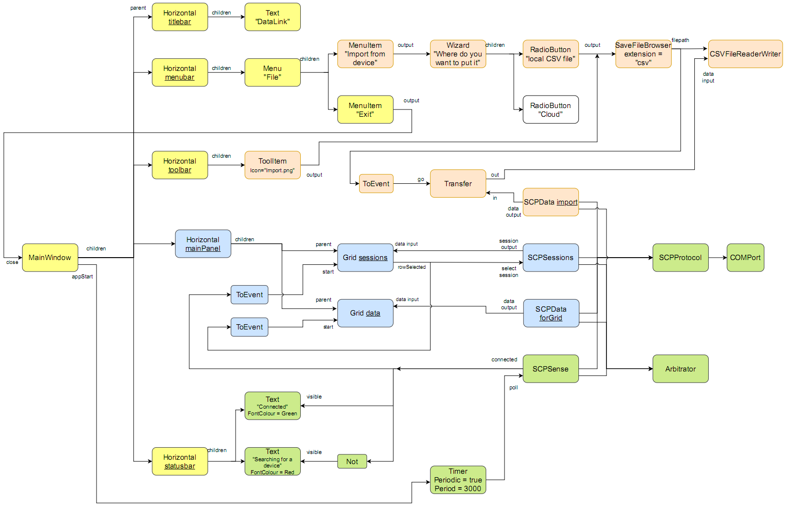
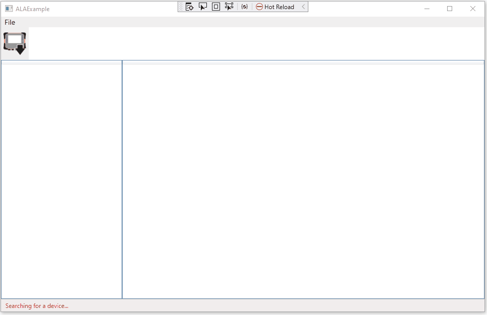
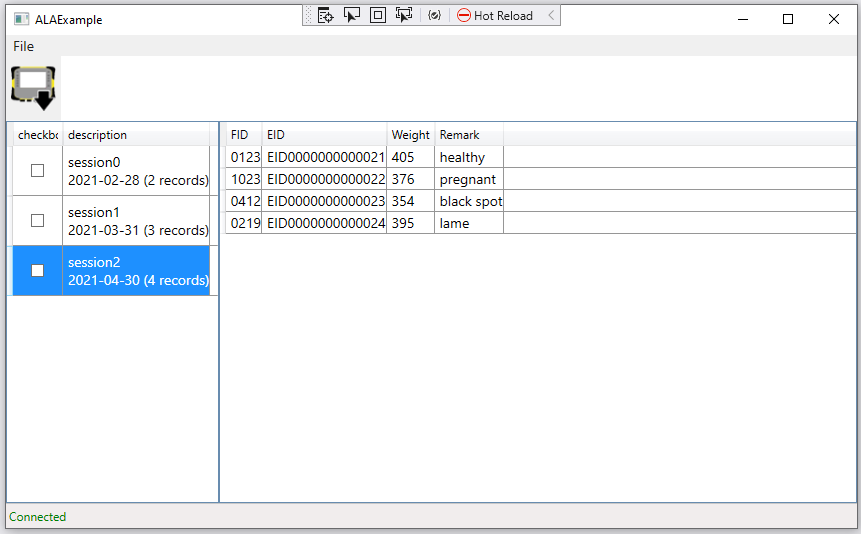

  
Table of Contents

  <ol>
    <li><a href="#about-the-project">About the project</a></li>
    <ul>
        <li><a href="#the-diagram">The diagram</a></li>
        <li><a href="#The-diagram-executing"> The diagram executing</a></li>
    </ul>
    <li><a href="#background">Background</a></li>
    <ul>
        <li><a href="#Abstraction-Layered-Architecture-brief-description">Abstraction Layered Architecture brief description</a></li>
    </ul>
    <li><a href="#To-run-the-example-application">To run the example application</a></li>
    <li><a href="#Built-with">Built with</a></li>
    <li><a href="#contributing">Contributing</a></li>
    <ul>
        <li><a href="#Future-work">Future work</a></li>
    </ul>
    <li><a href="#Authors">Authors</a></li>
    <li><a href="#license">License</a></li>
  </ol>

# About the project

This purpose of this project is an example application of ALA ([Abstraction Layered Architecture](AbstractionLayeredArchitecture.md)).

It's not about what the application itself does, it's about how all the code mechanics of an application conforming to this architecture works by example.

### The diagram

An ALA application expresses user stories in an executable way. It often uses a diagram because user stories themselves contain a network of relationships.

Consider the diagram below, which is the application's source code. (You can click on the diagram to get a clearer view.)  

It describes the user stories of a small desktop application. 

An ALA diagram expresses the user stories in terms of instances of *domain abstractions*, which are the boxes in the diagram. They are wired together by *ports*, which are *programming paradigms* implemented as interfaces. An ALA diagram is polyglot in programming paradigms, so some wires represent an event-driven programming paradigm, some represent a UI layout programming paradigm, some represent a data-flow programming paradigm, etc. 

The yellow user stories of the diagram express the base UI layout and the Exit menu item causes the application to close.

The green user stories of the diagram sense if a device is connected and displays "Searching for a device" or "Connected" in the statusbar. SCPSense knows how to send an SCP (Serial Command Protocol) command out on the serial port to poll for the presence of a device. It does this every 3 seconds when it gets an event from the Timer, which starts when the MainWindow sends an event to start the application. Also note that SCPSense uses an instance of an Arbitrator to ensure it has exclusive use of the device while using a command. The device is considered a one-at-a time resource. When SCPSense gets a response from a device, it outputs a boolean data-flow signal which changes the message on the statusbar, and signals the sessions Grid to start.

The blue user stories display data from the device. When the sessions grid gets its start signal, it requests data on a table-data-flow paradigm. SCPSessions knows how to get columns and rows of data from devices that describe the session files in that device. When the user clicks on one of the session rows, it outputs the index on its rowSelected port, which is wired to SCPSessions. SCPsession knows how to to tell the device to select a specific session. An event is also routed to the data Grid to tell it to start. Note that these two Grids are instances of the same domain abstraction configured with two different instance names. The data Grid now requests data using the table-data-flow programming paradigm, which will come from SCDData. SCPData knows how to get columns and rows of data from a single session in the device.

The brown user stories of the diagram get data off the device and write it to a CSV file. There is an "Import from device" menu item in the File menu, which when clicked outputs an event. This event opens up a Wizard which contains RadioButtons for selecting where the data is to go. When the user makes his selection, the relevant RadioButton outputs an event which opens a SaveFileBrowser. When the filepath is selected it informs a CSVFileReaderWriter. It also causes an event to go to a Transfer domain abstraction that knows how to pull all the rows and columns from a table-data-flow, and push it to another table-data-flow. table-data-flow supports both pull and push modes, but does so in small batches in case there is a lot of data. 

Question for thought: How many applications could you read the source code and understand it like we have just done right here in the readme? This diagram is not just documentation, it is source code. In this case we have hand translated the diagram into readable code which you can see in Application.cs. We have done this to connect the dots on how we get the diagram to execute without any magic. However, if the application diagram gets very large, we would want to make things even easier by auto-generating the wiring code.

### The diagram executing

To see the diagram executing, you can just download and execute the solution in Visual Studio. You will be able to use the application as shown by the gif below. (Not shown in the diagram is that we have wired in a software simulation of a real device to the COM port).

<!---

-->

## Background

ALAExample is a cut-down example of an application used by farmers to get data to/from their EID readers, livestock weighing devices, etc.

The full Windows PC desktop application was a research project for a software reference architecture called ALA [(Abstraction Layered Architecture)](http://www.abstractionlayeredarchitecture.com). ALA is theoretically optimized for the maintainabilty quality attribute by telling you how to organise code. This research was to measure if this is true in paractice.

The project was done by a masters student and internship students over two internships. By using the architecture, they were able to write quality code to replace a legacy degenerate application with approximately 2 man-years of effort compared with approximately 12 man-years of effort for the legacy application. To give an idea of size, the ALA version contains 55 KLOC and the legacy version 70 KLOC for approximately the same functionality.

<!---
[(Abstraction Layered Architecture)](http://www.abstractionlayeredarchitecture.com)
-->

### Abstraction Layered Architecture brief description

In ALA, the only unit of code is an abstraction. Dependencies must be on abstractions that are more abstract. This gives rise to abstraction layers as follows:

*Application layer:* The application layer and folder is the top layer. It contains application-diagram.pdf and its hand translation into code, application.cs.
The application uses classes in the... 

*Domain abstractions layer:* The domain abstractions layer and folder is the second layer. Domain abstractions must be more abstract (and therefore more reuseable) than the specific application. We even use multiple instances of some of them in the same diagram. The application and the domain abstractions use interfaces in the...

*Programming paradigms layer:* The programming paradigms layer and folder is the third layer. Programming paradigms must be even more abstract (and therefore even more reusable) than domain abstractions. The application.cs uses a *wireTo* extension method in the...

*Libraries layer:* The libraries layer and folder is the bottom layer. It contains the wireTo extension method used by Application.cs to implement each line in application-diagram. wireTo supports this whole pattern of expressing user stories through instances of domain abstractions wired together using programming paradigms. This pattern is one way to conform to the constraints provided by the fundamental rules of ALA.

There are no dependencies within layers, so all abstractions are like standalone programs given knowledge of the abstractions they use. Through the use of abstraction, the internals of all abstractions are zero-coupled in ALA, even going down the layers.

Knowledge of ALA itself is needed to understand the architecture of the code. Further details can be found in the Introduction and Chapter 2 of the web site <http://www.abstractionlayeredarchitecture.com>.

The only purpose of this example project is to show the actual working code for an example application conforming to ALA. 

## To run the example application

1. Clone this repository or download as a zip.
2. Open the solution in Visual Studio 2019 or later
3. When the application runs, you will see data already loaded from a simulated real device.
4. Click on the row on the left, and it will show data from different sessions on the right.
5. Click on File, Import from Device, to open a Wizard, then select Local CSV File, then enter a filename to save data to a CSV file.
6. Click on the Toolbar icon to do the same thing.

## Built with

C#, Visual Studio 2019

GALADE (Graphical ALA Development Environment) see Future work below. A GALADE version is a work-in-progress in a branch of this repository.

## Contributing

Contributions are what make the open source community such an amazing place to be learn, inspire, and create. Any contributions you make are **greatly appreciated**.

1. Fork the project using the button at top right of the main Github page or (<https://github.com/johnspray74/ALAExample/fork>)
2. Create your feature branch (`git checkout -b feature/AmazingFeature`)
3. Commit your changes (`git commit -am 'Add AmazingFeature'`)
4. Push to the branch (`git push origin feature/AmazingFeature`)
5. Open a Pull Request

### Future work

Swift, Java, Python and Rust versions needed.

We have a graphical tool called GALADE (Graphical ALA development environment) written by Arnab Sen here [https://github.com/arnab-sen/GALADE](https://github.com/arnab-sen/GALADE).

GALADE automatically generates code of course. GALADE also features automatic layout when drawing the diagram so that the developer can concentrate on expressing user stories and inventing the needed abstractions - a feature that we find critcally important because most drawing packages ask you to spend too much effort on layout. It also presents the boxes representing instances of domain abstractions with their configuration constructor parameters and properties ready to be filled in. It also shows all the ports ready to be wired. Importantly, it acheives this by reading the code in the classes in the DomainAbstractions folder. This is really powerful integration with your C# code, and supports round trip of both the application wiring code and the domain abstractions code.
 

We would love help to further develop GALADE to support ALA development, for example, a routing algorithm for its wiring, or to show errors for illegal dependencies according to the ALA fundmental rules.

We would also like to see other graphical tools based on Visual Studio and Eclipse graphical environments to generally support ALA and specifically to generate the wiring code from the diagram.

## Authors

Rosman Cheng, John Spray, Roopak Sinha, Arnab Sen

### Contact

John Spray - johnspray274@gmail.com

## License

This project is licensed under the terms of the MIT license. See [License.txt](License.txt)

## Acknowledgments

